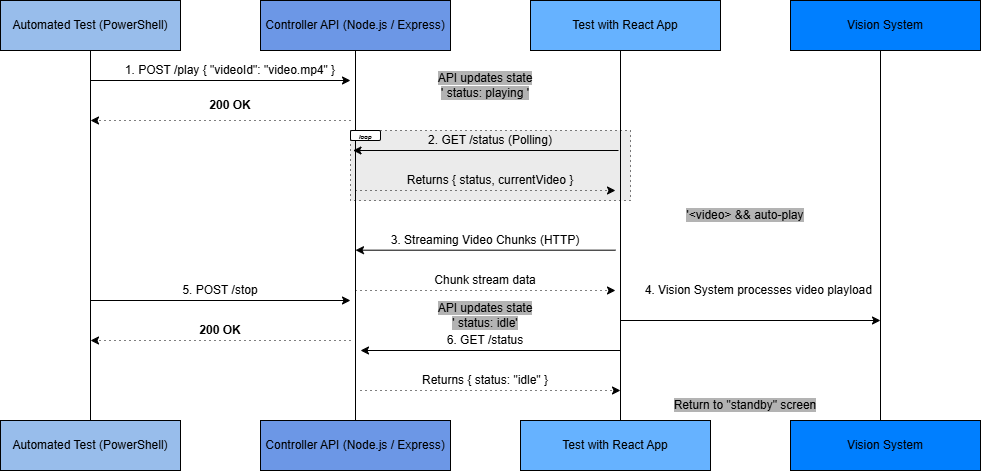

# Video Test Automation Tool 

## 1.My Thought Process & Architecture

To solve the problem efficiently, I decided to split the system into 3 decoupled pieces:
- **Frontend - React:** It constantly checks what scenario it should be playing.
- **Controller API (Backend - Node.js/Express):** The base or the central state manager. It exposes simple endpoints so that any test script can change the video state.
- **Test Orchestrator:** Any external script (in PowerShell) that triggers the REST API.

Sequence Diagram of how the components interact:


**Why did I choose this?**
Because this fully decouples the testing logic from the heavy video player UI. Your test scripts don't need to try and "click buttons" on a UI using Selenium (which is notoriously flaky for heavy video streaming and testing). Instead, they just send a tiny HTTP request (`POST /play`), the internal state updates, and the React app seamlessly auto-plays the video on screen. 

**What I know & how I'd improve it in a production setting:**
- **WebSockets / Server-Sent Events:** Right now, the React app uses standard short-polling (`setInterval` every 1 second) to check the `/status`. For a quick PoC it's fast to write, but in production, I would 100% use WebSockets (e.g., `Socket.io`) or SSE to push state changes instantly. This avoids network spam and gives microsecond accuracy to the tests.

## 2. How to Run the Demo (PowerShell)

You can control this entire application right from your PowerShell terminals. 

### A. Start the Backend API (The Controller)
Pop open a PowerShell window, navigate to the backend, and start the server:
```powershell
cd backend
node index.js
```
*(The Express server will start on port 3000)*

### B. Start the Frontend UI (The Vision Source)
Open a **second** PowerShell window, go to the frontend, and fire up React:
```powershell
cd frontend/video-frontend
npm start
```
*(A browser will pop open on port 3001. You'll see a dark blue screen saying it's waiting for a command to play the video)*

### C. Trigger Automated Tests via PowerShell
Open a **third** PowerShell window. Let's pretend this window is your automated test suite.

**1. Start the Scenario (Play Video)**
Run this exact command to tell the system to load the `video.mp4` scenario:
```powershell
Invoke-RestMethod -Uri "http://localhost:3000/play" -Method Post -ContentType "application/json" -Body '{"videoId": "video.mp4"}'
```
*The video instantly pops up and auto-plays on mute. The Vision system can now start doing its processing..*

**2. Check the Status**
If your test script needs to wait or know what is currently running on screen:
```powershell
Invoke-RestMethod -Uri "http://localhost:3000/status" -Method Get
```

**3. End the Scenario (Stop Video)**
When your Vision system test finishes successfully, clean up the environment so it's ready for the next run:
```powershell
Invoke-RestMethod -Uri "http://localhost:3000/stop" -Method Post
```
*The video disappears and now the interface is back to an `idle` state.*

---
